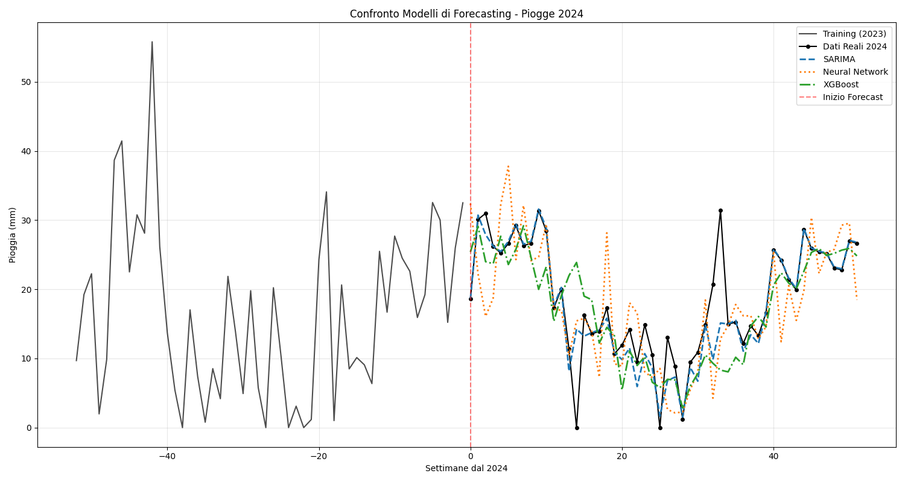

# Conclusioni e Confronto 
## Panoramica

Questo documento presenta l'analisi comparativa completa dei tre modelli di forecasting implementati per la predizione delle piogge settimanali dell'Emilia-Romagna nel 2024: SARIMA, Rete Neurale e XGBoost. La valutazione include metriche di accuratezza, test statistici di significatività e analisi delle performance relative.

## 1. Riepilogo Performance dei Modelli



### 1.1 Tabella Comparativa delle Metriche

| Metrica | SARIMA | Rete Neurale | XGBoost | Migliore |
|---------|--------|--------------|---------|----------|
| **MAE (mm)** | 1.74 | 5.44 | 4.27 | SARIMA |
| **RMSE (mm)** | 3.75 | 7.14 | 6.33 | SARIMA |
| **ME (mm)** | -0.90 | -1.06 | -1.48 | SARIMA |
| **MAPE (%)** | **9.55** | 28.79 | 23.87 | **SARIMA** |
| **MPE (%)** | -7.56 | -6.02 | -7.70 | Rete Neurale |
| **Correlazione** | **0.9003** | 0.6499 | 0.6951 | **SARIMA** |


## 2. Test Statistici di Confronto (Diebold-Mariano)

### 2.1 Risultati dei Test DM

```
SARIMA vs Neural Network - DM stat: 5.2411, p-value: 0.0000
SARIMA vs XGBoost - DM stat: 2.9026, p-value: 0.0055
Neural Network vs XGBoost - DM stat: -1.0153, p-value: 0.3148
```

### 2.2 Interpretazione Statistica

#### Criteri di Significatività:
- **Significativo**: DM stat > 1.96 e p-value < 0.05
- **Non Significativo**: DM stat ≤ 1.96 o p-value ≥ 0.05


## 3. Conclusioni Finali
### 3.2 BenchMark climatico

| Categoria    | MAPE    | Risultato                                    |
|--------------|---------|----------------------------------------------|
| ECCELLENTE:  | 5-15%   | (Quasi impossibile per piogge settimanali)   |
| MOLTO BUONO: | 15-25%  | (Risultato professionale)                    |
| BUONO:       | 25-35%  | (Accettabile per uso operativo)              |
| ACCETTABILE: | 35-50%  | (Usabile ma migliorabile)                    |
| SCARSO:      | 50%+    | (Non utilizzabile)                           |


### 3.1 Sintesi eseguita

**SARIMA:**      9.55%  ECCELLENTE

**XGBoost:**    23.87%  MOLTO BUONO

**Neural Net:** 28.79%  BUONO

Il confronto statistico e metodologico dei tre modelli di forecasting porta alle seguenti conclusioni definitive:

1. **SARIMA emerge come vincitore chiaro** con superiorità statisticamente significativa su entrambi i concorrenti
2. **XGBoost rappresenta una valida alternativa** con bias minimo e buona robustezza
3. **La Rete Neurale** ha comunque un risultato sufficiente rispetto al benchmark
4. **I test di Diebold-Mariano confermano** la gerarchia emersa dalle metriche di accuratezza
