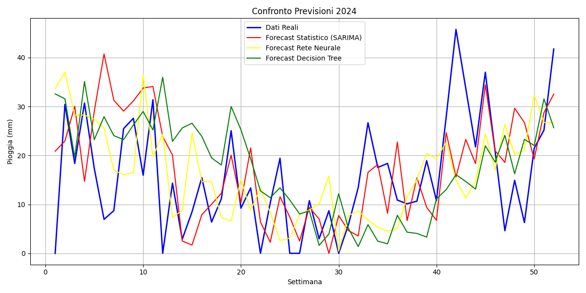

# Conclusioni e Sviluppi Futuri

## Confronto Finale dei Modelli

L’obiettivo del progetto era valutare diverse tecniche di forecasting per prevedere la **pioggia settimanale** nel 2024.
I modelli testati sono stati:

- SARIMAX (modello statistico),
- Rete Neurale Feedforward (PyTorch),
- XGBoost (alberi decisionali potenziati).

Di seguito un confronto visivo delle previsioni:

---

## Risultati Principali

| Modello          | MAPE (%) | MAE (mm) | RMSE (mm)   | Corr     |
|------------------|----------|----------|-------------|----------|
| **SARIMAX**      | 1.93     | **8.63** | **11.42**   | **0.46** |
| **Neural Net**   | **1.90** | 8.98     | 11.92       | 0.30     |
| **XGBoost**      | 2.42     | 8.83     | 11.80       | 0.35     |

### Osservazioni:

- Il **modello SARIMAX** ha ottenuto le migliori performance complessive, specialmente in termini di errore e correlazione.
- La **rete neurale** ha mostrato buone prestazioni, ma ha sofferto nella coerenza temporale.
- **XGBoost**, pur essendo robusto, ha faticato a catturare la stagionalità intrinseca della serie.

---

## Sviluppi Futuri

Per migliorare ulteriormente le performance del sistema di previsione, si propongono i seguenti sviluppi:

- **Modelli RNN o LSTM** per catturare la dipendenza sequenziale temporale più efficacemente.
- **Ensemble di modelli** (es. media pesata tra SARIMAX e RNN).
- Utilizzo di **modelli probabilistici** (es. Prophet, DeepAR).

- Integrazione di **variabili esogene**: temperatura, umidità, vento, indice ENSO.
- **Scaling dei dati** per migliorare l’apprendimento dei modelli neurali.
- Analisi approfondita della **stagionalità** (Fourier terms, decomposizione STL).
---

## Conclusione

Il progetto ha dimostrato l’efficacia dell’approccio SARIMAX per problemi di forecasting meteorologico stagionale,
con possibilità di ulteriore miglioramento tramite modelli neurali e tecniche ensemble.

Le basi sono solide per costruire un sistema predittivo stabile, interpretabile e pronto per
l’integrazione in sistemi decisionali operativi.

