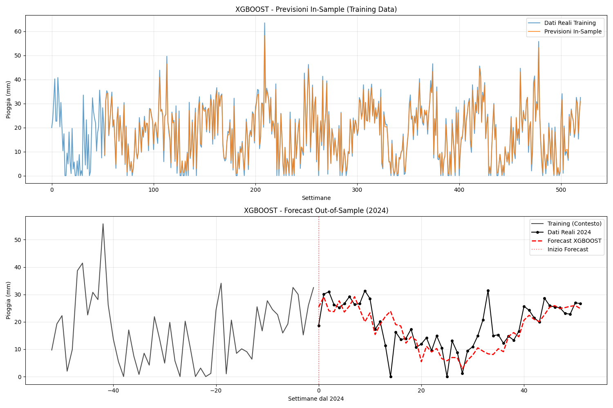

# Modello XGBoost 

## Panoramica

Il modulo `XGBoost_model.py` implementa un modello XGBoost (Extreme Gradient Boosting) per il forecasting delle piogge settimanali dell'Emilia-Romagna. Questo documento descrive l'implementazione del modello, i parametri utilizzati, i risultati ottenuti e l'interpretazione delle performance.

## 1. Introduzione al Modello XGBoost

### 1.1 Definizione
XGBoost (Extreme Gradient Boosting) è un algoritmo di machine learning basato su gradient boosting che combina multiple weak learners (tipicamente decision trees) per creare un modello predittivo robusto e accurato. È particolarmente efficace per problemi di regressione e classificazione con dati strutturati.

### 1.2 Principi Fondamentali
- **Ensemble Method**: Combina previsioni di multipli decision trees
- **Gradient Boosting**: Ogni albero corregge gli errori del precedente
- **Regularization**: Controllo integrato dell'overfitting
- **Parallel Processing**: Ottimizzazione computazionale avanzata

## 2. Architettura del Modello

### 2.1 Configurazione Utilizzata
```python
XGBRegressor(
    objective='reg:squarederror',
    n_estimators=1000,
    max_depth=5,
    learning_rate=0.01,
    subsample=0.6,
    colsample_bytree=0.8,
    gamma=1,
    random_state=42
)
```

### 2.2 Parametri del Modello

#### Parametri di Base:
- **objective**: 'reg:squarederror' (regressione con errore quadratico)
- **n_estimators**: 1000 (numero di alberi nell'ensemble)
- **random_state**: 60 (per riproducibilità)

#### Parametri di Struttura:
- **max_depth**: 5 (profondità massima degli alberi)
- **learning_rate**: 0.01 (tasso di apprendimento, eta)

#### Parametri di Regularization:
- **subsample**: 0.6 (frazione di campioni per ogni albero)
- **colsample_bytree**: 0.8 (frazione di features per ogni albero)
- **gamma**: 1 (minima riduzione di loss per split)

## 3. Preparazione Dati e Features

### 3.1 Configurazione del Dataset
```python
look_back = 52  # Usa 52 settimane per predire la settimana successiva
```

#### Struttura dei Dati:
- **Input Features (X)**: 104 valori di pioggia settimanale precedenti
- **Target (y)**: Valore di pioggia della settimana successiva
- **Dataset Shape**: X (416, 104), y (416,)
- **Approccio**: Supervised learning con sliding window

### 3.2 Feature Engineering
Il modello utilizza un approccio di **autoregressive features**:
- Ogni riga contiene 104 settimane consecutive
- Il target è la settimana immediatamente successiva
- Creazione di 416 esempi di training dal dataset originale

## 4. Forecasting Ricorsivo

### 4.1 Metodologia Ricorsiva
Il modello implementa un **forecasting ricorsivo multi-step**:

```python
def recursive_forecast_xgb(model, x_start, n_forecast):
    xinput = x_start.copy()
    forecast = []
    
    for step in range(n_forecast):
        pred = model.predict(xinput.reshape(1, -1))[0]
        forecast.append(pred)
        xinput = np.roll(xinput, -1)  # Shift della finestra
        xinput[-1] = pred             # Inserimento predizione
```

### 4.2 Processo Step-by-Step
1. **Inizializzazione**: Ultime 104 settimane del training set
2. **Predizione**: Genera forecast per t+1
3. **Update Window**: Rimuove valore più vecchio, aggiunge predizione
4. **Iterazione**: Ripete per tutte le 52 settimane del 2024

## 5. Risultati del Modello

### 5.1 Performance di Training
```
Dataset creato: X shape = (416, 104), y shape = (416,)
Usando 104 settimane per predire la settimana successiva
Modello addestrato con successo!
```

### 5.2 Metriche di Accuratezza



#### Risultati Ottenuti:
```
--- RISULTATI ACCURATEZZA XGBOOST ---
MAPE (Mean Absolute Percentage Error): 0.2387 (23.87%)
ME (Mean Error): -1.4770
MAE (Mean Absolute Error): 4.2696
MPE (Mean Percentage Error): -0.0770 (-7.70%)
RMSE (Root Mean Square Error): 6.3283
Correlazione: 0.6951
```


