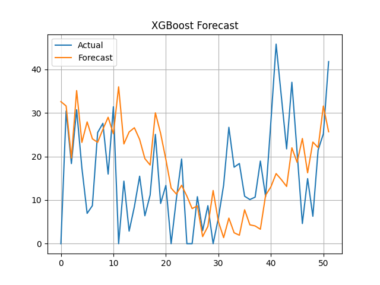

# Previsione di Pioggia Settimanale - XGBoost

## Teoria del Modello XGBoost

**XGBoost (Extreme Gradient Boosting)** è un algoritmo basato su alberi decisionali addestrati in sequenza. 
Ogni nuovo albero corregge gli errori residui commessi dai precedenti, migliorando progressivamente l’accuratezza.

### Caratteristiche principali:
- Addestramento rapido con gestione automatica di overfitting (via early stopping, regolarizzazione),
- Supporta feature storiche (look-back) e previsioni ricorsive,
- Resistente al rumore nei dati e adatto a problemi di regressione.

### Approccio utilizzato:
- Finestra mobile (`look_back = 104`): ogni istanza di training contiene 52 settimane di dati storici,
- **Forecast ricorsivo**: il modello utilizza la sua ultima previsione come input per la successiva, 
per predire tutte le 52 settimane.

---

## Codice di Implementazione (estratto)

```
from notNeuralModel import train_xgb_model, recursive_forecast_xgb, plot_xgb_forecast

look_back = 52
n_forecast = len(test)
X, y = create_dataset(train, look_back)

model, x_train, y_test = train_xgb_model(X, y, n_forecast)

x_start = x_train[-1]
forecast = recursive_forecast_xgb(model, x_start, n_forecast)

plot_xgb_forecast(test, forecast)

print("XGBoost Accuracy: ")
print(forecast_accuracy(forecast, test))
```

### Visualizzazione dei Risultati


- Linea blu: precipitazioni osservate nel 2024

- Linea arancione: valori previsti dal modello XGBoost

### Metriche di accuratezza 

| Metrica   | Valore |
| --------- |--------|
| MAPE (%)  | 2.42   |
| MAE (mm)  | 8.83   |
| RMSE (mm) | 11.8   |
| Corr      | 0.35   |
| ME        | 2.55   |
| MPE (%)   | 2.16   |

**Interpretazione**:
- Il MAPE è leggermente superiore rispetto a SARIMAX e RNN, suggerendo minore precisione relativa.

- La correlazione di 0.35 segnala una media capacità del modello di seguire l’andamento temporale dei dati.

Il modello XGBoost è potente ma in questo caso mostra prestazioni inferiori rispetto al modello SARIMAX 
e alla rete neurale, soprattutto per quanto riguarda la coerenza temporale. Tuttavia, resta utile come baseline 
o in combinazione con altri modelli:
