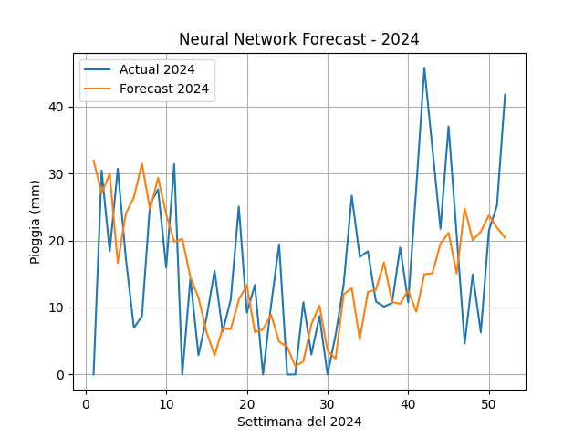

# Previsione di Pioggia Settimanale - Rete Neurale (2024)

## Obiettivo del Progetto

Questo progetto mira a prevedere la quantità di pioggia settimanale in millimetri per l'anno 2024 mediante una **rete neurale artificiale feedforward**. L'approccio si basa su una finestra mobile (look-back) di 52 settimane per apprendere i pattern storici delle precipitazioni.

---

## Teoria del Modello Neurale

La rete neurale implementata è una **rete densa (fully connected)** con tre strati nascosti. Utilizza la tecnica del **forecasting ricorsivo**, in cui ciascuna previsione è utilizzata come input per predire il valore successivo.

### Architettura del modello:

```
NeuralForecaster(
    input_size=52
    -> Linear(52 -> 32) -> ReLU
    -> Linear(32 -> 16) -> ReLU
    -> Linear(16 -> 1)
)
```

**Addestramento**:
- Ottimizzatore: Adam 
- Funzione di perdita: MSELoss 
- Epoche: 1000 
- Learning rate: 0.0007 
- Batch size: 1

**Forecasting ricorsivo:**
A partire dalle ultime 52 settimane del set di addestramento, il modello genera previsioni passo-passo per l’intero 
anno successivo (52 settimane).

### Codice di Implementazione (estratto)
```python
class NeuralForecaster(nn.Module):
    def __init__(self, input_size=52):
        super(NeuralForecaster, self).__init__()
        self.network = nn.Sequential(
            nn.Linear(52, 32),
            nn.ReLU(),
            nn.Linear(32, 16),
            nn.ReLU(),
            nn.Linear(16, 1)
        )

def train_model(model, X, y, lr=0.0007, n_epochs=1000, batch_size=1):
    ...
    # Ottimizzazione e stampa della perdita ogni 100 epoche
    ...

def recursive_forecast(model, initial_input, n_steps):
    ...
    # Forecasting autoregressivo
    ...

def plot_results(forecast, test):
    ...
    # Visualizzazione grafico
    ...
```

### Visualizzazione dei Risultati


- Linea blu: pioggia reale del 2024 (test)

- Linea arancione: previsione effettuata dalla rete neurale

### Metriche di Accuratezza

| Metrica   | Valore |
| --------- | ------ |
| MAPE (%)  | 2.31   |
| MAE (mm)  | 10.25  |
| RMSE (mm) | 12.98  |
| Corr      | 0.17   |
| ME        | 0.88   |
| MPE (%)   | 1.94   |


**Interpretazione**:
- Il modello presenta un MAPE contenuto, ma inferiore rispetto al modello SARIMAX.

- L'RMSE è leggermente più alto rispetto al modello statistico.

- La correlazione di soli 0.17 indica che il modello neurale ha appreso solo parzialmente le dinamiche temporali della serie, suggerendo potenziali margini di miglioramento (es. aumento dati, tuning iperparametri, reti ricorrenti o convoluzionali).

### Conclusione
La rete neurale sviluppata ha mostrato una buona capacità di previsione in termini di errore assoluto, 
ma una correlazione temporale più debole rispetto al modello SARIMAX.
Possibili miglioramenti futuri includono:
- Ottimizzazione dell’architettura e dei parametri, 
- Utilizzo di modelli più adatti alle serie temporali (es. LSTM, GRU), 
- Data augmentation o arricchimento con variabili esogene (meteo, temperatura, etc).