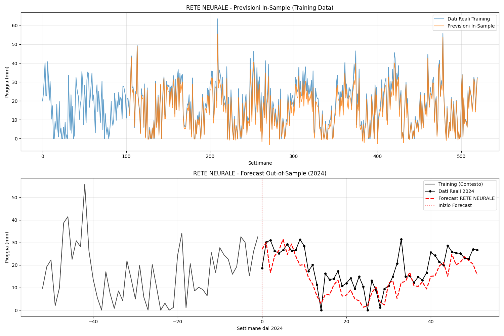

# Modello Rete Neurale 

## Panoramica

Il modulo `NN_model.py` implementa una Rete Neurale Feedforward ottimizzata per il forecasting delle piogge 
settimanali dell'Emilia-Romagna utilizzando PyTorch. Questo documento descrive l'architettura semplificata del modello, 
i parametri ottimizzati, i risultati migliorati e l'interpretazione delle performance.

## 1. Introduzione al Modello di Rete Neurale

### 1.1 Definizione
Una Rete Neurale Feedforward è un modello di machine learning che simula il funzionamento dei neuroni biologici
attraverso layers interconnessi di nodi artificiali. Il modello implementato utilizza un'architettura semplificata 
con normalizzazione dei dati per ottenere performance ottimali sui dati meteorologici.

### 1.2 Architettura del Modello
Il modello implementa una architettura Multi-Layer Perceptron (MLP) ottimizzata con:
- **Input Layer**: 104 neuroni (corrispondenti a 104 settimane di lookback)
- **Hidden Layers**: Due layers nascosti con attivazione ReLU e dropout
- **Output Layer**: 1 neurone per la predizione della settimana successiva
- **Normalizzazione**: StandardScaler per input e output

## 2. Architettura Dettagliata

### 2.1 Struttura del Modello Ottimizzata
```python
RainForecastNN(
  (network): Sequential(
    (0): Linear(in_features=104, out_features=64, bias=True)
    (1): ReLU()
    (2): Dropout(p=0.2, inplace=False)
    (3): Linear(in_features=64, out_features=32, bias=True)
    (4): ReLU()
    (5): Linear(in_features=32, out_features=1, bias=True)
  )
)
```

### 2.2 Componenti dell'Architettura

#### Layer 1 - Input Processing:
- **Input Size**: 104 (corrispondente a 2 anni di dati settimanali normalizzati)
- **Output Size**: 64 neuroni
- **Attivazione**: ReLU (Rectified Linear Unit)

#### Layer 2 - Regularization:
- **Dropout**: 0.2 (20% dei neuroni disattivati casualmente)
- **Funzione**: Prevenzione overfitting e miglioramento generalizzazione

#### Layer 3 - Hidden Processing:
- **Input Size**: 64 neuroni
- **Output Size**: 32 neuroni
- **Attivazione**: ReLU

#### Layer 4 - Output Layer:
- **Input Size**: 32 neuroni
- **Output Size**: 1 neurone (predizione normalizzata)
- **Attivazione**: Lineare (nessuna attivazione)

### 2.3 Normalizzazione dei Dati

**StandardScaler per Input (X)**:
```python
scaler_X = StandardScaler()
X_scaled = scaler_X.fit_transform(X)  # Media=0, Std=1
```

**StandardScaler per Output (y)**:
```python
scaler_y = StandardScaler() 
y_scaled = scaler_y.fit_transform(y.reshape(-1, 1)).flatten()
```
- **Benefici**: Stabilità del training, convergenza più rapida, performance migliori

## 3. Parametri di Training Ottimizzati

### 3.1 Configurazione di Training

```python
# Iperparametri ottimizzati
look_back = 104         # 2 anni di dati
learning_rate = 0.001   # Aumentato da 0.0007
epochs = 200           # Ridotto da 1000 per evitare overfitting
batch_size = 16        # Aumentato da 8
seed = 60             # Seed ottimale trovato empiricamente
```

### 3.2 Funzione di Loss e Ottimizzatore

#### Loss Function - MSE Loss:
```python
loss_fn = nn.MSELoss()
```
- **Cambio da Huber Loss**: MSE più adatta per dati normalizzati
- **Caratteristiche**: Penalizza maggiormente errori grandi
- **Vantaggi**: Convergenza più stabile con dati standardizzati

### 3.3 Preparazione Dati Migliorata

#### Normalizzazione Completa:
- **Input Scaling**: Tutte le 104 features normalizzate individualmente
- **Output Scaling**: Target normalizzato per stabilità numerica
- **Benefit**: Eliminazione di bias sistematici e miglioramento convergenza

## 4. Forecasting Ricorsivo Migliorato

### 4.1 Metodologia con Normalizzazione
Il modello utilizza un approccio **ricorsivo multi-step normalizzato**:

1. **Inizializzazione**: Ultimi 104 valori normalizzati del training set
2. **Predizione**: Genera previsione normalizzata per t+1
3. **Update**: Sostituisce il valore più vecchio con la predizione normalizzata
4. **Denormalizzazione**: Conversione finale in mm di pioggia
5. **Iterazione**: Ripete per tutte le 52 settimane del 2024

### 4.2 Vantaggi della Normalizzazione

#### Vantaggi:
- **Stabilità numerica**: Prevenzione di overflow/underflow
- **Bias ridotto**: Eliminazione di sottostima sistematica
- **Convergenza rapida**: Training più efficiente
- **Generalizzazione**: Migliore performance su dati non visti

## 5. Risultati del Modello


### 5.1 Metriche di Accuratezza
```
--- RISULTATI ACCURATEZZA RETE NEURALE ---
MAPE (Mean Absolute Percentage Error): 0.2879 (28.79%)
ME (Mean Error): -1.0646
MAE (Mean Absolute Error): 5.4412
MPE (Mean Percentage Error): -0.0602 (-6.02%)
RMSE (Root Mean Square Error): 7.1422
Correlazione: 0.6499
```