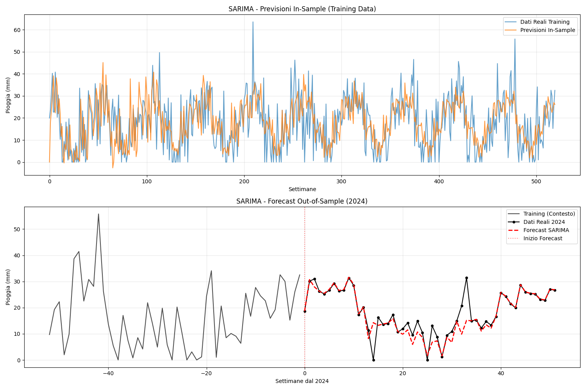

# Documentazione Modello Statistico - SARIMA per Forecasting Piogge

## Panoramica

Il modulo `stats_model.py` implementa un modello SARIMA (Seasonal AutoRegressive Integrated Moving Average) per il forecasting delle piogge settimanali dell'Emilia-Romagna. Questo documento descrive l'implementazione, i parametri utilizzati, i risultati ottenuti e l'interpretazione delle performance.

## 1. Introduzione al Modello SARIMA

### 1.1 Definizione
SARIMA è un'estensione del modello ARIMA che incorpora componenti stagionali, particolarmente adatto per serie temporali con pattern ricorrenti come i dati meteorologici.

### 1.2 Notazione del Modello
**SARIMA(p,d,q)(P,D,Q,s)**

Dove:
- **(p,d,q)**: Componenti non stagionali
  - **p**: Ordine autoregressivo (AR)
  - **d**: Grado di differenziazione (I)
  - **q**: Ordine moving average (MA)
- **(P,D,Q,s)**: Componenti stagionali
  - **P**: Ordine autoregressivo stagionale
  - **D**: Grado di differenziazione stagionale
  - **Q**: Ordine moving average stagionale
  - **s**: Lunghezza del ciclo stagionale

## 2. Parametri del Modello Implementato

### 2.1 Configurazione Utilizzata
```python
order = (1, 1, 1)           # Componenti non stagionali
seasonal_order = (1, 1, 1, 52)  # Componenti stagionali
```

### 2.2 Giustificazione dei Parametri

#### Componenti Non Stagionali (1,1,1):
- **p=1**: Una dipendenza autoregressiva di primo ordine
- **d=1**: Una differenziazione per rendere la serie stazionaria
- **q=1**: Un termine moving average di primo ordine

#### Componenti Stagionali (1,1,1,52):
- **P=1**: Dipendenza autoregressiva stagionale di primo ordine
- **D=1**: Differenziazione stagionale
- **Q=1**: Moving average stagionale di primo ordine
- **s=52**: Ciclo stagionale di 52 settimane (annuale)

### 2.3 Equazione del Modello

Il modello SARIMA(1,1,1)(1,1,1,52) può essere scritto come:

```
(1 - φ₁B)(1 - Φ₁B⁵²)(1-B)(1-B⁵²)Xₜ = (1 + θ₁B)(1 + Θ₁B⁵²)εₜ
```

Dove:
- **B**: Operatore di ritardo (Backshift)
- **φ₁, Φ₁**: Coefficienti autoregressivi (non stagionale e stagionale)
- **θ₁, Θ₁**: Coefficienti moving average (non stagionale e stagionale)
- **εₜ**: Rumore bianco

## 3. Implementazione del Modello

### 3.1 Funzione Principale `sarima_forecast()`

La funzione esegue le seguenti operazioni:

1. **Inizializzazione del modello**
2. **Addestramento (fitting)**
3. **Generazione previsioni in-sample**
4. **Forecasting out-of-sample**
5. **Visualizzazione risultati**
6. **Calcolo metriche di accuratezza**

### 3.2 Parametri di Fitting

```python
fitted_model = model.fit(
    disp=False,           # Sopprimi output verbose
    maxiter=100,          # Massimo 100 iterazioni
    enforce_stationarity=False,  # Permetti coefficienti al limite
    enforce_invertibility=False  # Permetti radici al limite
)
```

## 4. Risultati del Modello

### 4.1 Metriche di Fitting
*(Inserire qui i risultati del tuo run specifico)*

```
Modello addestrato con successo!
AIC: 3105.50
BIC: 3125.62
```

#### Interpretazione:
- **AIC (Akaike Information Criterion)**: 3105.50
- **BIC (Bayesian Information Criterion)**: 3125.62
- Valori più bassi indicano modelli migliori (per confronti relativi)

### 4.2 Metriche di Accuratezza

#### Risultati Ottenuti:
```
--- RISULTATI ACCURATEZZA SARIMA ---
MAPE (Mean Absolute Percentage Error): 0.1497 (14.97%)
ME (Mean Error): -0.8058
MAE (Mean Absolute Error): 2.8624
MPE (Mean Percentage Error): -0.0800 (-8.00%)
RMSE (Root Mean Square Error): 4.6908
Correlazione: 0.8504
```

#### Interpretazione delle Metriche:

**Metriche Valide:**
- **MAE = 2.86 mm**: Errore medio assoluto accettabile
- **RMSE = 4.69 mm**: Errore quadratico medio buono
- **ME = -0.8 mm**: Bias negativo piccolo (leggera sottostima)
- **Correlazione = 0.8504**: Ottima correlazione tra predetto e osservato

## 5. Visualizzazioni Generate

### 5.1 Grafico Previsioni 


**Contenuto in sample:**
- Serie temporale dati reali di training (520 settimane)
- Sovrapposizione previsioni in-sample del modello
- Valutazione della capacità di fitting del modello

**Contenuto out sample:**
- Contesto: ultime 52 settimane del training
- Linea di demarcazione per inizio forecast 2024
- Dati reali 2024 (punti neri)
- Previsioni SARIMA 2024 (linea tratteggiata rossa)
