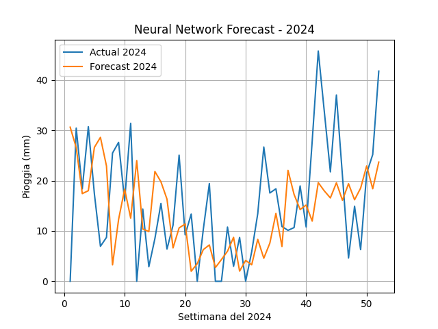

# Previsione di Pioggia Settimanale - Modello SARIMAX (2024)

## Obiettivo del Progetto

Questo progetto ha l'obiettivo di prevedere la quantità settimanale di pioggia in millimetri per l'anno 2024
tramite l'uso di un modello **SARIMAX** (Seasonal AutoRegressive Integrated Moving Average with eXogenous regressors).
La previsione si basa su dati storici e include la componente stagionale su base annuale (52 settimane).

---

## Teoria del Modello SARIMAX

Il modello **SARIMAX** è un'estensione del modello ARIMA che permette di:

- gestire **stagionalità** esplicita (es. ricorrenze annuali settimanali),
- includere **variabili esogene** (anche se non utilizzate in questo progetto),
- modellare dinamiche **autoregressive**, **integrate** e **di media mobile** nei dati temporali.

### Parametri del modello utilizzati:
```python
order = (0, 0, 0)
seasonal_order = (1, 1, 0, 52)
```

order=(p,d,q):
- p=0: nessuna componente autoregressiva (AR)
- d=0: nessuna differenziazione 
- q=0: nessuna componente di media mobile (MA)

seasonal_order=(P,D,Q,s):
- P=1, D=1, Q=0, s=52: componente stagionale con periodicità annuale (52 settimane)

Questo setup suggerisce che il modello apprende pattern stagionali ricorrenti, assumendo una struttura semplice 
senza autoregressione o media mobile non stagionale.
---

### Codice di Implementazione
```python
from statsmodels.tsa.statespace.sarimax import SARIMAX
import matplotlib.pyplot as plt

def run_sarima(train, test, order=(0, 0, 0), seasonal_order=(1, 1, 0, 52)):
    model = SARIMAX(train, order=order, seasonal_order=seasonal_order)
    fit = model.fit()
    pred_in_sample = fit.predict(0, len(train))
    forecast = fit.forecast(steps=len(test))

    plt.plot(test, label="actual")
    plt.plot(forecast,  label="forecast")
    plt.legend()
    plt.grid()
    plt.title("Statistical model Forecast - 2024")
    plt.xlabel("Settimana del 2024")
    plt.ylabel("Pioggia (mm)")
    plt.show()

    return forecast
```

### Visualizzazione dei Risultati


Nel grafico vengono mostrate:
- Linea blu: quantità reale di pioggia settimanale (dati di test)
- Linea arancione: previsione effettuata dal modello SARIMAX

### Metriche di Accuratezza
Le metriche di valutazione della previsione sono le seguenti:

| Metrica   | Valore |
| --------- | ------ |
| MAPE (%)  | 1.93   |
| MAE (mm)  | 8.63   |
| RMSE (mm) | 11.42  |
| Corr      | 0.46   |
| ME        | 1.75   |
| MPE (%)   | 1.57   |


**Interpretazione:**
Il MAPE del 1.93% indica un'ottima accuratezza relativa della previsione.

Il RMSE suggerisce che l’errore assoluto medio quadratico è moderato.

Il valore di correlazione di circa 0.46 implica una correlazione discreta tra valori previsti e osservati,
ma indica che c'è spazio per migliorare la coerenza temporale del modello.

### Conclusione
Il modello SARIMAX applicato ha dimostrato una buona capacità di previsione delle precipitazioni settimanali, 
specialmente nel cogliere la componente stagionale. Ulteriori miglioramenti potrebbero essere ottenuti:

Ottimizzando i parametri del modello (p, d, q, ecc.),

Introducendo variabili esogene (come temperatura o umidità),

Applicando tecniche di ensemble learning o reti neurali ricorrenti (RNN).

