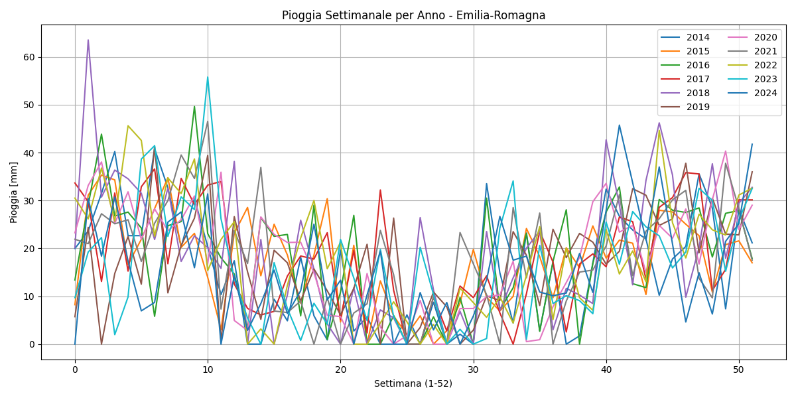

# Preprocessing dei Dati

## Cos'è il Preprocessing

Spiegazione generale del concetto di preprocessing nei modelli predittivi e nel contesto di Operational Analytics.

## Preprocessing nel Progetto

Il grafico mostra una certa quantità di rumore, ovvero variazioni casuali o irregolari nei dati di pioggia settimanale.
Questo è particolarmente evidente nei seguenti aspetti:

- Variazioni settimanali brusche: I valori di pioggia cambiano repentinamente da una settimana all'altra, 
anche di decine di millimetri. Questo è un segno tipico di rumore nei dati meteorologici.

- Andamenti irregolari tra gli anni: Sebbene ci siano alcune tendenze stagionali (ad esempio, 
maggiore pioggia in primavera e autunno), le curve dei diversi anni (2020–2024) si discostano molto tra loro,
indicando alta variabilità.

- Picchi isolati: Alcuni anni mostrano picchi molto alti (es. 2023 intorno alla settimana 10)
che potrebbero essere veri eventi estremi ma possono anche rappresentare valori anomali o picchi rumorosi.

### Origine dei Dati
### Pulizia e Normalizzazione
### Feature Engineering
### Gestione dei Valori Mancanti
### Suddivisione Training/Test
