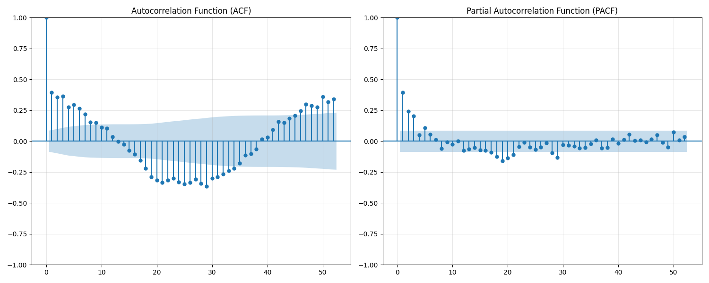

# Preprocessing

## Panoramica

Il modulo `preprocessing.py` gestisce il caricamento, l'analisi esplorativa e la preparazione dei dati delle piogge settimanali dell'Emilia-Romagna per il forecasting. Questo documento descrive in dettaglio tutte le operazioni eseguite sui dati.

## 1. Struttura del Dataset

### 1.1 Formato dei Dati
- **File sorgente**: `Pioggia_Settimanale_EmiliaRomagna.csv`
- **Struttura**: 52 righe (settimane) × 11 colonne (anni 2014-2024)
- **Tipo di dati**: Valori di precipitazione in millimetri (mm)
- **Granularità temporale**: Settimanale (52 settimane per anno)

### 1.2 Organizzazione Temporale
```
Anni di Training: 2014-2023 (10 anni × 52 settimane = 520 osservazioni)
Anno di Test: 2024 (52 settimane)
Dataset Totale: 572 osservazioni settimanali
```

## 2. Caricamento e Trasformazione Dati

### 2.1 Funzione `load_and_preprocess_data()`

La funzione principale esegue le seguenti operazioni:

1. **Caricamento CSV**: Lettura del file usando `pandas.read_csv()`
2. **Trasformazione in Serie Temporale**: Concatenazione delle colonne anno per anno
3. **Divisione Train/Test**: Separazione 2014-2023 (training) e 2024 (test)
4. **Conversione a NumPy Arrays**: Per compatibilità con i modelli di ML

```python
# Esempio di trasformazione
train_data = []
for year in range(2014, 2024):  # 2014-2023 per training
    train_data.extend(df[str(year)].values)
```

## 3. Analisi Esplorativa dei Dati

### 3.1 Funzione `analyze_data()`

Questa funzione produce un'analisi statistica completa per ogni dataset (training e test).

#### Statistiche Calcolate:
- **Lunghezza**: Numero totale di osservazioni
- **Range**: Valori minimo e massimo
- **Tendenza Centrale**: Media e mediana
- **Dispersione**: Deviazione standard
- **Distribuzione**: 25° e 75° percentile
- **Valori Speciali**: Conteggio e percentuale di valori zero

#### Output Esempio:
```
Training Data (2014-2023):
  Lunghezza: 520
  Min: 0.00 mm
  Max: 63.53 mm
  Media: 17.65 mm
  Mediana: 14.23 mm
  Deviazione Standard: 13.45 mm
  Valori zero: 45 (8.7%)
```

### 3.2 Visualizzazioni Prodotte

**Grafico 1: Analisi Training Data** 


- **Subplot 1**: Serie temporale completa (520 settimane)
- **Subplot 2**: Istogramma della distribuzione
- **Subplot 3**: Box plot per identificare outliers

**Grafico 2: Analisi Test Data** 

- **Subplot 1**: Serie temporale 2024 (52 settimane)
- **Subplot 2**: Istogramma della distribuzione 2024
- **Subplot 3**: Box plot dei dati 2024

## 4. Gestione Outliers e Valori Anomali

### 4.1 Funzione `handle_outliers()`

#### Metodi di Identificazione Implementati:

**Metodo IQR (Interquartile Range)** - *Default*:
```python
Q1 = np.percentile(data, 25)
Q3 = np.percentile(data, 75)
IQR = Q3 - Q1
lower_bound = Q1 - 1.5 * IQR
upper_bound = Q3 + 1.5 * IQR
```

**Metodo Z-Score**:
```python
z_scores = np.abs(stats.zscore(data))
outliers_mask = z_scores > threshold  # threshold=3
```

#### Filosofia di Gestione:
- **Non Rimozione**: Gli outliers non vengono rimossi dal dataset
- **Motivazione**: Eventi meteorologici estremi (es. alluvioni, periodi di siccità) sono parte naturale della variabilità climatica
- **Approccio**: Identificazione e documentazione, mantenimento nel dataset

### 4.2 Gestione Valori Zero

I valori zero rappresentano settimane senza precipitazioni significative e vengono:
- **Mantenuti**: Fanno parte del pattern naturale
- **Analizzati**: Calcolata frequenza e distribuzione stagionale
- **Documentati**: Percentuale per anno e dataset complessivo

## 5. Test di Stazionarietà

### 5.1 Funzione `check_stationarity()`

Implementa il **Test di Augmented Dickey-Fuller (ADF)**:

#### Ipotesi del Test:
- **H₀ (Null Hypothesis)**: La serie temporale ha una radice unitaria (NON stazionaria)
- **H₁ (Alternative Hypothesis)**: La serie temporale è stazionaria

#### Interpretazione dei Risultati:
```python
if p_value <= 0.05:
    print("Serie STAZIONARIA - Rifiutiamo H₀")
else:
    print("Serie NON stazionaria - Non possiamo rifiutare H₀")
```

#### Output Tipico:
```
Test di Augmented Dickey-Fuller per la stazionarietà:
ADF Statistic: -8.234567
p-value: 0.000001
Valori critici:
    1%: -3.437
    5%: -2.864
    10%: -2.568
Risultato: Rifiutiamo l'ipotesi nulla. La serie è STAZIONARIA.
```

## 6. Analisi di Autocorrelazione

### 6.1 Funzione `visualize_autocorrelation()`

Genera le funzioni di autocorrelazione per identificare pattern temporali e stagionalità.

**Grafico 3: Autocorrelation Analysis**

- **Subplot 1**: ACF (Autocorrelation Function) - 52 lags
- **Subplot 2**: PACF (Partial Autocorrelation Function) - 52 lags

#### Analisi della Stagionalità:
La funzione calcola correlazioni specifiche per identificare pattern annuali:

```python
Lag 52 settimane (1 anno): correlazione = 0.382
Lag 104 settimane (2 anni): correlazione = 0.459
Lag 156 settimane (3 anni): correlazione = 0.361
```

#### Interpretazione:
- **Lag 52**: Correlazione annuale (stesso periodo dell'anno precedente)
- **Valori Positivi**: Indicano pattern stagionali ricorrenti
- **Decadimento**: La correlazione diminuisce con l'aumentare della distanza temporale
